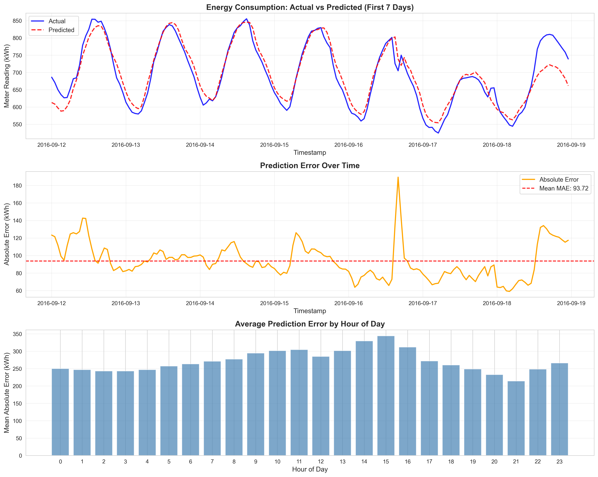
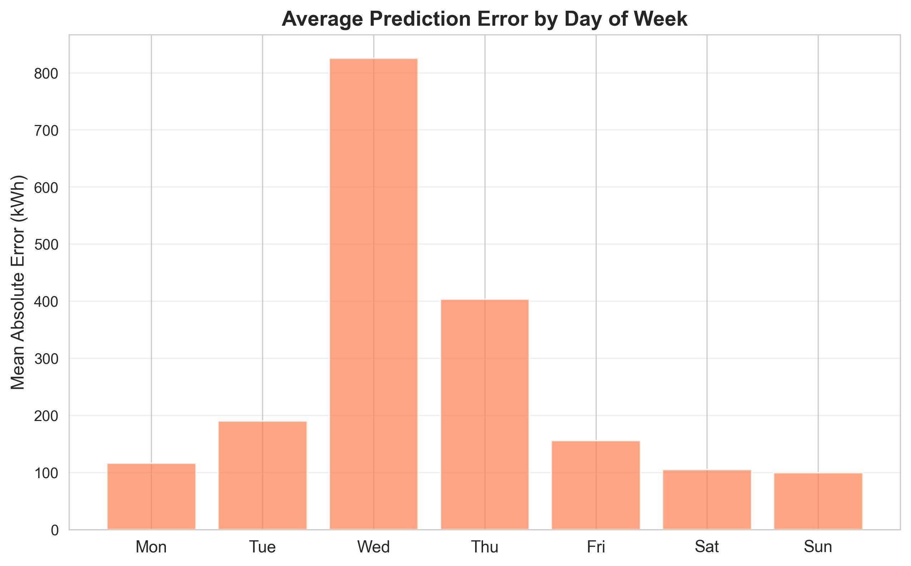

# ⚡ Energy Forecasting Project – Log1p Transformation & Feature Engineering Update

## 📘 Overview
This document summarizes all key changes made to the energy forecasting pipeline, focusing on:

- Introduction of **log1p transformation** (`reading_meter_log`)
- Addition of **temporal trend features**
- Alignment of **model training, evaluation, and visualization** to the new log-based workflow

---

## 🧮 1. Log1p Transformation Integration

### 🔹 Purpose
Energy meter readings often have a **heavy-tailed distribution** — meaning extreme spikes cause unstable model learning and metric distortion.  
To stabilize this, the target variable (`meter_reading`) is now log-transformed.

### 🔹 Implementation

| Stage | Variable | Operation | Description |
|--------|-----------|------------|--------------|
| Preprocessing | `reading_meter_log` | `np.log1p(df['meter_reading'])` | Added as a new feature column |
| Model training | `TARGET = 'reading_meter_log'` | Model trains directly on log-transformed values |
| Prediction | `y_pred_log` | Predictions remain in log scale |
| Post-prediction (optional) | `np.expm1(y_pred_log)` | Convert back to kWh if required for metrics |

✅ **New Column Added:**  
`reading_meter_log` → smoothed log1p representation of energy readings.
## 🖼️ 2. Visualization Outputs

Below are the latest visualization results generated after applying the **log1p transformation** and enhanced temporal features.

---

### 🔹 Comprehensive Log1p Analysis
This figure compares model performance across time using log-transformed meter readings.  
It highlights smoother prediction trends and reduced error volatility.


---

### 🔹 Temporal Analysis (Raw Scale)
Visual comparison of actual vs predicted readings in the original kWh scale.  
This version helps evaluate the model’s real-world interpretability.



---

### 🔹 Weekly Error Patterns
Average prediction errors grouped by day of the week.  
Useful for detecting recurring operational or behavioral patterns in energy consumption.



---

✅ **Tip:**  
You can view these plots directly in VS Code (`Ctrl + Shift + V`) or on GitHub for full Markdown rendering.


```python
df['reading_meter_log'] = np.log1p(df['meter_reading'])

